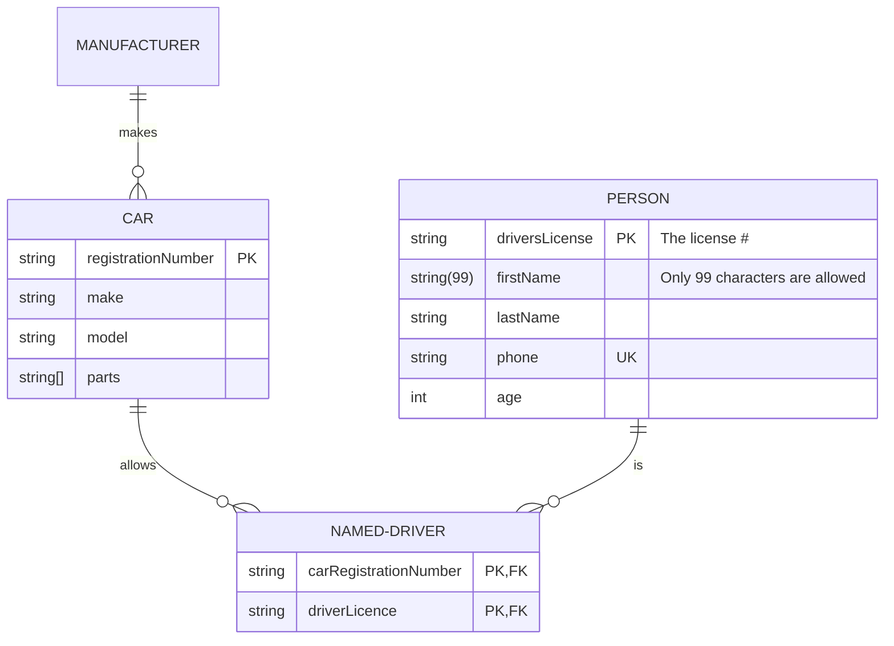

# ข้อที่ 3: ออกแบบ Web API ระบบซื้อสินค้าออนไลน์

## คำอธิบาย
โจทย์ข้อนี้เป็นการวัดทักษะการออกแบบระบบเชิงเทคนิค **ไม่ต้องเขียนโค้ด** โดยให้ผู้เข้าสอบวิเคราะห์ **ความต้องการของลูกค้า** ที่อยู่ด้านล่าง แล้วตอบคำถามตามที่กำหนดไว้

## ความต้องการของลูกค้า
ลูกค้าต้องการสร้างเว็บสั่งซื้อสินค้าออนไลน์ที่ **สามารถรองรับผู้ใช้งานหลายล้านคนเใช้งานพร้อมๆกันได้โดยไม่มีปัญหา** โดยผู้ใช้จะต้องเลือกสินค้าที่ต้องการลงตะกร้าก่อนแล้วค่อยนำไปชำระเงิน ซึ่งลูกค้ากำหนดความต้องการเบื้องต้นดังนี้

* **ผู้ใช้งาน**
  * ไม่จำเป็นต้อง login ก็สามารถสั่งซื้อสินค้าได้
* **ตะกร้าสินค้า**
  * สามารถหยิบสินค้าหลายประเภทใส่ในตะกร้าเดียวกันได้
  * สามารถ ดู/เพิ่ม/ลบ รายการสินค้าที่อยู่ตะกร้าได้
  * สามารถระบุที่อยู่จัดส่งและเบอร์โทรติดต่อได้
  * สามารถระบุ **โค้ดส่วนลด** เพื่อรับส่วนลดสินค้าได้สูงสุด 1 โค้ดต่อการสั่งซื้อ
  * สามารถนำตะกร้าไปชำระเงินได้
* **โค้ดส่วนลด**
  * สามารถใช้ลดราคาสินค้าที่อยู่ในตะกร้าได้
  * ในระบบมีโค้ดส่วนลดได้หลายโค้ด
  * โค้ดส่วนลดแต่ละโค้ดจะมีจำนวนจำกัด และ มีวันหมดอายุ
  * โค้ดที่หมดอายุแล้วจะไม่สามารถนำมาใช้ได้
  * การลดราคาสินค้าจากการใช้โค้ดส่วนลดมี 2 แบบคือ
    * ลดเป็นเปอร์เซ็นต์ (%)
    * ลดเป็นจำนวนเงินคงที่
  * โค้ดส่วนลดจะถูกกำหนดเงื่อนไขตามหมวดหมู่สินค้า เช่น ใช้ได้กับทุกประเภทสินค้า, ใช้ได้เฉพาะเครื่องดื่ม, ใช้ได้เฉพาะเครื่องใช้ไฟฟ้า ฯลฯ
* **คลังสินค้า**
  * คลังสินค้าในระบบมีเพียง 2 ประเภทคือ
    * **Physical Product** สินค้ามีจำนวนจำกัดในคลัง หากสินค้าหมด จะไม่สามารถสั่งซื้อได้ จนกว่าจะถูกเติมเข้ามาใหม่
    * **Digital Product** สินค้าไม่มีจำนวนจำกัด สามารถสั่งซื้อได้ตลอดเวลา
* **การชำระเงิน**
  * ผู้ใช้จะต้องเห็นราคาสินค้าที่ต้องจ่ายในตะกร้า ทั้งก่อนคิดส่วนลด และ หลังคิดส่วนลด
  * ตะกร้าจะต้องถูกกำหนดที่อยู่จัดส่งและเบอร์โทรติดต่อก่อนถึงจะสามารถนำมาชำระเงินได้
  * รองรับการชำระเงินผ่านบัตรเครดิตเท่านั้น
  * เมื่อชำระเงินสำเร็จระบบจะส่ง **SMS ตามเบอร์โทรที่ระบุ** ให้กับผู้ใช้

## การส่งคำตอบ
ให้แก้ไขไฟล์ `Exam03/Answer.md` เพื่อตอบคำถาม 3 ข้อด้านล่าง ให้สอดคล้องกับความต้องการของลูกค้า
1. จะออกแบบ REST API ทั้งหมดอย่างไร
2. จะใช้ Database อะไร และมี Schema อย่างไร
3. มีข้อควรระวังเรื่องอะไรบ้าง พร้อมเหตุผลประกอบ

### ตัวอย่าง REST API  
```
POST /api/users
Content-Type: application/json

Request:
{
    "name": "John Doe",
    "email": "john.doe@example.com",
}

Response:
{
    "id": 1234,
    "name": "John Doe",
    "email": "john.doe@example.com"
}
```

### ตัวอย่าง Schema



> **หมายเหตุ**
> 1. สามารถใช้ tools ที่ถนัดในการเขียน diagram ได้ (ไม่จำเป็นต้องเขียนเป็น mermaid syntax)
> 2. สามารถแนบไฟล์รูปเข้าไปในโฟเดอร์ `Exam03` ได้ และใช้ markdown syntax อธิบายรูปประกอบการตอบคำถาม

## เงื่อนไขการให้คะแนน
1. ความเหมาะสมในการออกแบบ REST API
2. ความเหมาะสมในการเลือกใช้ Database และ Schema
3. ความถูกต้องในการออกแบบตาม Design standards
4. ความครอบคลุมในการวิเคราะห์ประเด็นต่างๆ
5. ความเป็นไปได้ในการนำไปพัฒนาระบบจริง